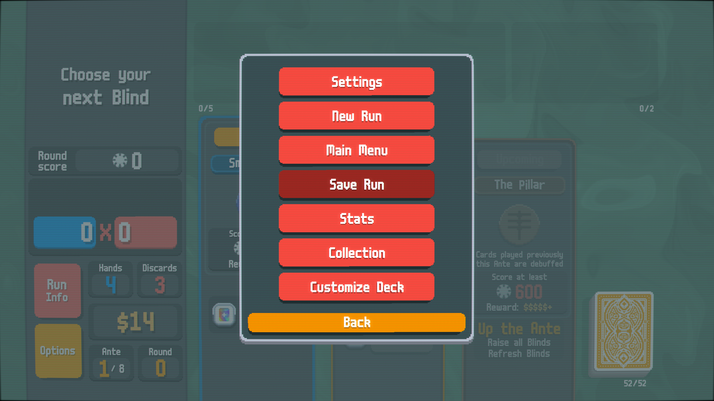

<h1 align="center">Divvy's History for Balatro</h1>

<b>Keep track of all your played hands throughout a run!</b>

## Installation

 0. Install [Lovely](https://github.com/ethangreen-dev/lovely-injector) 
   Do you have Steamodded? Then, you probably already have Lovely!
 1. Download the latest release of this mod, [here](https://github.com/DivvyCr/Balatro-History/releases/latest)
 2. Unzip the downloaded folder to `C:\Users\[USER]\AppData\Roaming\Balatro\Mods` 
   You should have the following folders: 
   `...\Balatro\Mods\DVHistory` 
   `...\Balatro\Mods\DVSettings` 
 3. Launch the game!
 
## Features
 
 - History of **all your played hands**, available at any point during a run!
 - Ability to **save and load any run** at a later date
 - During a run, the last couple of rounds are **automatically saved** &ndash; made a mistake? Just go back and retry!
 - All saved runs are **shown as summaries** when selecting one &ndash; no need to remember file names!

> [!TIP]
> All saved runs are stored in `...\Balatro\[PROFILE]\DVHistory` where `[PROFILE]` is either 1, 2, or 3.
> Feel free to delete unnecessary run files, but you won't be able to recover them!

> [!TIP]
> Autosaves are stored in `...\Balatro\[PROFILE]\DVHistory\_autosaves`, by default only 10 total autosaves are kept.
> Any extra autosaves are deleted (oldest first). You can change this number in the game's settings.

## How to Use

There is now a new button in the run setup screen, which allows you to select any of your saved runs:

> [!NOTE]
> The game will automatically save the last couple of rounds, **by default only 5 autosaves are kept per run**.

Below, you can see five autosaves from one run (which has seed `TFHH6EEY` and unique id `17dc-fcf1`),
with the oldest of those five autosaves being previewed by hovering over it.

You can also see a manual save there, which has a longer name including the round number. 
You can create manual saves from the options menu in the game (see the other image).

&nbsp;

## See It In Action

The history saves with your run!

&nbsp;

Demonstration of the game autosaving, then the player manually saving, then the player loading the autosave to go back in time!

